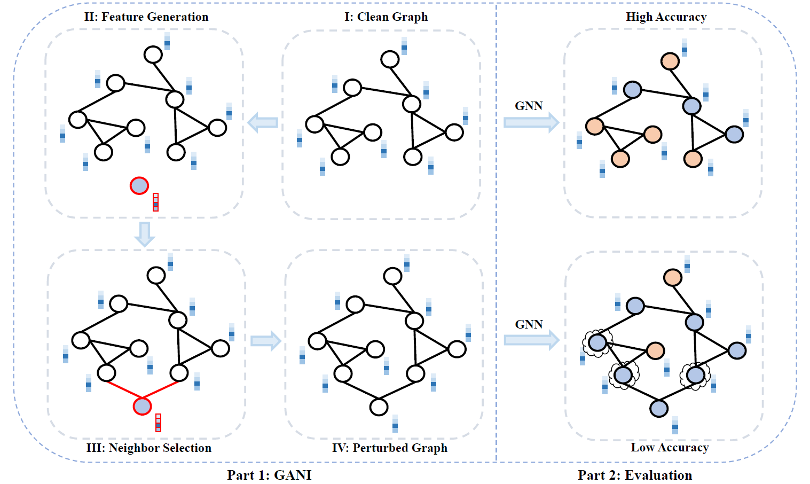

## GANI: <u>G</u>lobal <u>A</u>ttacks via <u>N</u>ode <u>I</u>njections

The relevant codes for "**GANI: Global Attacks on Graph Neural Networks via Imperceptible Node Injections**", [[arXiv](https://arxiv.org/abs/2210.12598)], [[IEEE TCSS](https://ieeexplore.ieee.org/document/10443466)].

<p align="center">  <p align="center"><em>Fig. 1. A systematic framework of GANI and corresponding evaluations. The red marks indicate the corresponding generated fake node including both features and neighbors. The colors of nodes represent the classes, and the cloud-shaped circle means a wrong classification of the node.</em></p>


- ### Requirements

  - torch == 1.8.0

  - deeprobust == 0.2.1

  - Other packages will be installed together when installing deeprobust

    

- ### Code illustrations 

  - **data**: Folder to save the generated adversarial data after attacks.

  - **dataset**: Folder of clean datasets.

  - **ori_model**: Folder of original models trained from the clean data.

  - **ga_homophily.py**: The genetic algorithm for neighbor selection of GANI.

  - **main.py**: Examples for using GANI to achieve node injection attacks.

  - **node_injection.py**: Main codes for GANI.

  - **utils.py**: Main codes for evaluation.

    

- ### Run the demo

  ```
  python main.py
  ```

  

- ### Cite

  If you find this work helpful, please cite our paper, Thank you.

  ```
   @article{fang2024gani,
      title={Gani: global attacks on graph neural networks via imperceptible node injections},
      author={Fang, Junyuan and Wen, Haixian and Wu, Jiajing and Xuan, Qi and Zheng, Zibin and Tse, Chi K},
      journal={IEEE Transactions on Computational Social Systems},
      year={2024},
      publisher={IEEE}
    }
  ```

  
